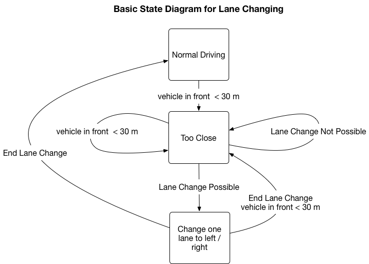

# CarND-Path-Planning-Project
[](http://www.udacity.com/drive)

This repository contains my solution to the Udacity Self-Driving Car NanoDegree Path Planning Project.

The repository contains the following notable files:

* `src/Planner.cpp` : Implementation of path planner for the project
* `src/main.cpp` :  `main()` function for the project
* this readme file

## Basic Build Instructions

1. Clone this repo.
2. Make a build directory: `mkdir build && cd build`
3. Compile: `cmake .. && make`
4. Run it: `./path_planning`.

## Path Generation 

For path generation, I followed the approach laid out in the project's walkthrough video. It uses the tk::spline library (http://kluge.in-chemnitz.de/opensource/spline/) referenced in the project repository to generate smooth paths.

Paths to different lanes (when needed) are created by modifying the `mLane` property of the planner class.

The path generation comprises the following steps:

 1. Use car's previous previous state as reference if previous path is empty, else use it as basis for generating the new path.

 2. Generate 3 spline points on target lane (`mLane`) 30, 60, and 90 meters away.

 ```
 // add evenly spaced points in Frenet
 vector<double> next_wp0 = getXY(car_s+30,
                                 (2+4*mLane),
                                 map_waypoints_s,
                                 map_waypoints_x,
                                 map_waypoints_y);
vector<double> next_wp1 = getXY(  car_s+60,
                                  (2+4*mLane),
                                  map_waypoints_s,
                                  map_waypoints_x,
                                  map_waypoints_y);
vector<double> next_wp2 = getXY(car_s+90,
                                 (2+4*mLane),
                                  map_waypoints_s,
                                  map_waypoints_x,
                                  map_waypoints_y);
 ```
 For spline generation, we use a car-centric coordinate system, i.e., transformed from Frenet to cartesian to a shifted and rotated local coordinate system where the car is the origin facing up:

 ```
 // shift points to local reference frame
  for (int i = 0; i < ptsx.size(); i++)
  {
    double shift_x = ptsx[i] - ref_x;
    double shift_y = ptsy[i] - ref_y;
    ptsx[i] = shift_x * cos(0 - ref_yaw) - shift_y * sin(0 - ref_yaw);
    ptsy[i] = shift_x * sin(0 - ref_yaw) + shift_y * cos(0 - ref_yaw);
  }

  tk::spline s;

  // set the spaced-out points to define the spline
  s.set_points(ptsx, ptsy);
 ```

 3. Sample from Spline to missing points up to our desired path length `K_PATH_POINTS`, in our case set to 50. Sampling takes the vehicle's current speed into account, using the N formula which was derived in the walkthrough video: `double N = target_dist / (.02 * ref_vel / 2.24);`.

 4. Sampled points are converted back to world-centric x,y coordinates, pushed to complete the previous path and then sent to the simulator.
##

## Driving Behavior and State Machine

The behavior code I implemented follows a a simple state machine for driving behavior as shown the following figure:



In the "normal driving" state, the vehicle keeps to .5 miles under the speed limit and stays in the same lane.

When the car encounters a slower car to the front in the "normal driving" state, the FSM transitions to the "too close" state. This initiates a number of actions in the planner. (1) The car speed is reduced until it is at the safe following value `K_SLOW_REF_VEL`. (2) We assume (naively) that it would be best for our progress at this point to try to change lanes.

Therefore, if we are in the middle lane, we randomly select the lane to the left/right for consideration. If the vehicle is situated at the extreme left/right lanes, we chose the lane to the right/left (respectively) for further consideration.

The `testLaneChange` method of the planner class tests the lane for the suitability of a lane change. If it is suitable the planner initiates a lane change. And goes into the "change lane" state. If not it remains in the "too close" state and waits for the next update.

I use random selection instead of a cost function as (a) a cost function is not required in the rubric and (b) it accomplishes the same goal of helping the car to exit dense traffic situations, albeit in a greedy and perhaps non-optimal way.  

## Testing for the Suitability of Lane Changes

As already mentioned, the `testLaneChange` methods tests the suitability of a lane change. It takes the current car information, the sensor fusion information as well as the desired lane as input and outputs a boolean decision.

Before even initiating `testLaneChange`, however, we check some basic preconditions for lane changing, i.e., (1) we are not already in a lane change and (2) we are at a minimum safe speed to initiate lane changes (to reduce the risk of getting rear-ended by other traffic).

`testLaneChange` basically tests sensed traffic on the target lane for a suitable entry gap (if multiple vehicles are detected on the same target lane). This is accomplished by that `acceptableGapExists` method, that  *sorts* the list of detected vehicles by Frenet s distance and calculates gaps between these vehicles and the centroid of the gap. If this coincides with a location that is reachable by the spline-generated path (i.e., 90 m ahead), the lane change is initiated.

Before allowing the car to change lanes, however, we also test for vehicles in close proximity to the vehicle, i.e., minimum 10m in front and 25 m to the rear, again to reduce the chance of collisions occurring during the lane-changing maneuver.  
